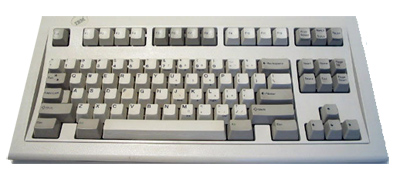
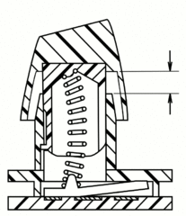

Nostalgia bucklespring keyboard sound
=====================================

Copyright 2016-2025 Ico Doornekamp

This project emulates the sound of my old faithful IBM Model-M space saver
bucklespring keyboard while typing on my notebook, mainly for the purpose of
annoying the hell out of my coworkers.




Bucklespring runs as a background process and plays back the sound of each key
pressed and released on your keyboard, just as if you were using an IBM
Model-M. The sound of each key has carefully been sampled, and is played back
while simulating the proper distance and direction for a realistic 3D sound
palette of pure nostalgic bliss.

To temporarily silence bucklespring, for example to enter secrets, press
ScrollLock twice (but be aware that those ScrollLock events _are_ delivered to
the application); same to unmute. The keycode for muting can be changed with
the `-m` option. Use keycode 0 to disable the mute function.

Installation
------------

[](https://repology.org/project/bucklespring/versions)

### Debian

Bucklespring is available in the latest Debian and Ubuntu dev-releases, so you can
install with

```
$ sudo apt-get install bucklespring
```

### VoidLinux

Bucklespring is available in the VoidLinux repositories, so you can install with

```
$ sudo xbps-install -S bucklespring
```

### FreeBSD

Bucklespring can be installed via package:

```
$ pkg install bucklespring
```

or built via port:

```
$ cd /usr/ports/games/bucklespring
$ make install clean
```

### Linux, building from source

To compile on debian-based linux distributions, first make sure the require
libraries and header files are installed, then simply run `make`:

Every flavour needs OpenAL and alure.  `buckle-x11` needs libX11 and libXtst
on top of that, and `buckle-libinput` needs libinput, libudev and
libwayland-client.  Building from a git checkout rather than a release tarball
also needs autoconf, automake and pkg-config.

#### Dependencies on Debian
```
$ sudo apt-get install build-essential autoconf automake pkg-config \
    libopenal-dev libalure-dev libxtst-dev \
    libinput-dev libudev-dev libwayland-dev
```

#### Dependencies on Arch Linux
```
$ sudo pacman -S base-devel autoconf automake pkgconf openal alure libxtst \
    libinput systemd-libs wayland
```

#### Dependencies on Fedora Linux
```
$ sudo dnf install gcc autoconf automake pkgconf openal-soft-devel \
    alure-devel libX11-devel libXtst-devel \
    libinput-devel systemd-devel wayland-devel
```

#### Building
```
$ ./configure
$ make
$ ./buckle-x11
```

From a git checkout, run `autoreconf -i` once before `./configure`.

There is one executable per source of key events, and `configure` builds each
one whose dependencies it finds, so the command above generally produces two:

* `buckle-x11` grabs events through X11, and so only hears keys typed within
  an X session.
* `buckle-libinput` reads the raw input devices in `/dev/input` instead, which
  is what works under a Wayland compositor and on the console.  Those devices
  are not readable by ordinary users, so this one needs the access granting
  first; see "Reading the input devices" below.

Pass `--disable-libinput` or `--disable-x11` to build just the one, and
`--enable-libinput` to insist on it rather than let a missing library quietly
turn it off.  `./configure --help` lists the rest.

#### Reading the input devices

`buckle-libinput` needs read access to `/dev/input/event*`, and running it as
root is no answer: it then no longer reaches the sound daemon of your session.
A udev rule is installed which grants that access to whoever is logged in at
the local seat, and it does nothing until you arm it:

```
$ sudo mkdir -p /etc/bucklespring
$ sudo touch /etc/bucklespring/uaccess
$ sudo udevadm trigger --subsystem-match=input --action=change
```

Read the comments in the rule before you do: that access lets any process of
yours read every keystroke on the machine, passwords typed into other
programs included.  Delete the flag file and trigger again to take it back.

#### Starting it automatically

A systemd user unit is installed for each flavour, tied to the desktop session
rather than to login, so it stops when you log out:

```
$ systemctl --user enable --now buckle-x11
```

#### Using snap on Ubuntu (since 16.04) and other distros

```
$ sudo snap install bucklespring
$ bucklespring.buckle
```

The snap includes the OpenAL configuration tweaks mentioned in this README.
See http://snapcraft.io/ for more info about Snap packages


### MacOS

I've heard rumours that bucklespring also runs on MacOS. I've been told that
the following should do:

```
$ brew install alure pkg-config autoconf automake
$ git clone https://github.com/zevv/bucklespring.git && cd bucklespring
$ autoreconf -i
$ ./configure
$ make
$ ./buckle-mac
```

Note that you need superuser privileges to create the event tap on Mac OS X.
Also give your terminal Accessibility rights: system preferences -> security -> privacy -> accessibility

If you want to use buckle while doing normal work, add an & behind the command.
```
$ sudo ./buckle-mac &
```

### Windows

[The program has been compiled](https://github.com/Matin6725/bucklespring-Windows/releases/tag/bucklespring-Windows), but it has not yet received Microsoft's security certificate. Therefore, it may be detected as a virus by some antivirus software. To view reports from some antivirus programs, you can visit [link to reports](https://www.virustotal.com/gui/file/fe4a813c39793515d726311da50b9ac5e64e6d87ab21c8a16b8980b756a4e07b?nocache=1).

For better performance and to resolve some issues, it is recommended to run the program in **Administrator** mode.


Usage
-----

````
Usage: buckle-x11 [options]

Options:

  -d, --device=DEVICE       use OpenAL audio device DEVICE
  -f, --fallback-sound      use a fallback sound for unknown keys
  -g, --gain=GAIN           set playback gain [0..100]
  -m, --mute-keycode=CODE   use CODE as mute key (default 0x46 for scroll lock)
  -M, --mute                start the program muted
  -c, --no-click[=LIST]     don't play a sound on mouse click; LIST
                            narrows it to some of left, middle, right,
                            side, extra, wheel, hwheel, all, none
  -h, --help                show help
  -l, --list-devices        list available OpenAL audio devices
  -p, --audio-path=PATH     load .wav files from directory PATH
  -r, --no-repeat           stay silent while a held key auto repeats
      --repeat-delay=MS     wait MS before the first repeat, overriding
                            what the compositor or the kernel says
      --repeat-rate=HZ      make HZ repeats per second, likewise
  -s, --stereo-width=WIDTH  set stereo width [0..100]
  -v, --verbose             increase verbosity / debugging
  -V, --version             show version and exit
````

The mouse clicks as well as the keyboard: the buttons, and the scroll wheel,
one click per detent.  `--no-click` silences all of it, and `--no-click=wheel`
only the wheel.

A key held down long enough to repeat clicks for every repeat.  Under Wayland
the delay and the rate are read from the compositor, which is the only thing
that knows them; on a console they come from the input device.  `--no-repeat`
goes back to one click however long the key is held.

OpenAL notes
------------


Bucklespring uses the OpenAL library for mixing samples and providing a
realistic 3D audio playback. This section contains some tips and tricks for
properly tuning OpenAL for bucklespring.

* The default OpenAL settings can cause a slight delay in playback. Edit or create
  the OpenAL configuration file `~/.alsoftrc` and add the following options:

 ````
 period_size = 32
 periods = 4
 ````

* If you are using headphones, enabling the head-related-transfer functions in OpenAL
  for a better 3D sound:

 ````
 hrtf = true
 ````

* When starting an OpenAL application, the internal sound card is selected for output,
  and you might not be able to change the device using pavucontrol. The option to select
  an alternate device is present, but choosing the device has no effect. To solve this,
  add the following option to the OpenAL configuration file:

 ````
 allow-moves = true
 ````
